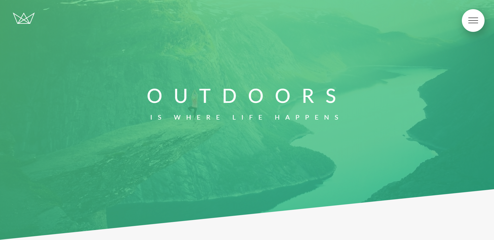

<!-- PROJECT LOGO -->
<br />
<p align="center">
  <a href="https://github.com/guimarbe/natours">
    
  </a>
</p>

<!-- PROJECT NAME -->
# Natours
Virtual site of a touring company focused on organazing nature tours.

<!-- TABLE OF CONTENTS -->
## Table of Contents
* [About the Project](#about-the-project)
	* [Sass](#sass)
	* [BEM Methodology](#bem-methodology)
	* [Architecture](#architecture)
* [Getting Started](#getting-started)
	* [Prerequisites](#prerequisites)
	* [Installing](#installing)
* [Usage](#usage)
* [Deployment](#deployment)
* [Built With](#built-with)
* [Authors](#authors)
* [License](#license)
* [Contact](#contact)
* [Acknowlegments](#acknowledgements)


## About the Project

<br />
Natours is a web page example developed by Jonas Schmedtmann in the Udemy course "Advanced CSS and Sass course". I wrote this code to learn the advanced techniques used nowadays to develop modern web pages. Besides, this code will help to develop other webpages as a code reference.

**Notes**
>I've applied some personal changes in this project, so the final result may not be the same as the original code developed by Jonas. It has some visual changes and functional changes in the js code.

Showing up next, we are going to describe the three pilars of this project: Sass, BEM methodoloy and the project architecture.

### Sass
This project is a great introductions to use Sass code. Its awesome benefits are:
* Using variables, @mixins and @extends to improve the code.
* Nesting the CSS selectors to have a visual hierarchy.
* Using different files for abstracts, components, layouts...
* Preprocessing all the SCSS code and joint in one output CSS file.

### BEM Methodology
In this project, I used the BEM (Block, Element, Modifier) methodology, wich is a component-based approach to web development. The idea behind it is to divide the user interface into independent blocks. This makes interface development easy and fast even with a complex UI, and it allows reuse of existing code without copying and pasting. For exemple:
```html
<!-- HTML code -->
<header class="header">
	<h2 class="header__heading header__heading--medium"></h2>
	<button class="btn btn--white"></button>
</header>
```
```css
// SCSS Code
.header {

	// We are using nesting here (header__heading)
	&__heading {
		font-size: 45px;
		text-transform: uppercase;
		font-weight: 400;
		line-height: 1.6;

		// More nesting here (header__heading--medium)
		&--medium {
			color: blue;
			font-size: 20px;
		}
	}
}

.btn {
	cursor: pointer;
	border: none;
	border-radius: 50px;
	font-size: 16px;
	text-transform: uppercase;
	background-color: blue;
	color: #fff;

	// This represents btn--white.
	&--white {
		background-color: #fff;
		color: #000;
	}
}
```
As you can see,
- *header* is the **block**.
- *heading* is the **element** of the **block** *header*.
- *medium* and *white* are the **modifiers** of *header__heading* and *btn*, respectively.

This methodology is really useful in natours project and web development in general. It allows me to create a visual hierarchy to write the HTML code and it simplifies the code due to the nesting, membership and optionality that allows the BEM approach.

### Architecture
The project has been developed taking in mind a solid architecture for web development. At first glance, it has a classic folder distribution:
* **css**: fonts, icons and precompiled css files are located in this folder.
* **img**: background video and images, logos, pictures and favicon are hosted inside this folder.
* **js**: the logic part of the code is located here.
* **sass**: our Sassy CSS files are here. I'm going to discuss more about this later.
* *index.html*: our webpage. Just HTML code.

But the most important part is the **sass** folder. Inside this, we have all the sassy code divided in multiple files and orderer in common folders to better organize the whole project. The architecture is compound by:

* **abstracts**
	* *_functions.scss*
	* *_mixins.scss*: all the reusable CSS code is located here.
	* *_variables.scss*: all variables of the project: colors, font-sizes, paddings...
* **base**
	* *_animations.scss*: it hosts *@keyframes*, mainly.
	* *_base.scss*: html and body selectors are declared here. Same as root font size.
	* *_typography.scss*: all related about typography: headings, paragraph, etc.
	* *_utilities.scss*: some kind of reusable classes here.
* **components**
	* *A lot of components!*: all the components used in this project are located here.
* **layout**
	* *_footer.scss*: footer code here.
	* *_grid.scss*: this project uses a grid system based on float elements.
	* *_header.scss*: header code here.
	* *_navigation.scss*: this is the code of the navbar.
* **pages**
	* *_home.scss*: this file is composed by all the <section>'s of the project.
* *main.scss*

Finally, we have the *main.scss*, that it joins all SCSS files in one using the statement *@import*.

In terms of development, is really important taking care of the folder hierarchy and how to order the elements. This kind of architecture is only possible due to the power of Sass. And it improves the workflow a lot!

<!-- GETTING STARTED -->
## Getting Started
To setting up the project locally you can download a copy of this project clicking on the *Clone or download* and then *Download ZIP*, or you can follow these simple exemple steps to get a copy on your repository.

### Prerequisites
First things first, you need to install npm to use all the tools provided in the project.
1. Open the Command Promt (on Windows) or Terminal (iOS) and type:
```
$ npm install npm@latest -g
```

### Installing
2. Clone the repository:
```
$ git clone https://github.com/guimarbe/natours.git
```

3. Inside package.json there are all the dependendies used in this project. Install all NPM packages in the project folder:
```
$ npm install
```
4. You can open the **Development Process** typing:
```
$ npm start
```
5. That's it! natours is running succesfully :smile:


<!-- USAGE -->
## Usage
Feel free to use this code (see more on [license](#license)).
* Watch and interact with the different elements along the webpage.
* With your web browser, you can inspect all the elements to know how was built.
* Toggle the device toolbar to see how it's responsive.

## Built with
This project list the following frameworks for its development:
* [jQuery](https://jquery.com/) - The JavaScript library
* [waypoints](http://imakewebthings.com/waypoints/) - Trigger a function when you scroll to an element.

<!-- CONTRIBUTING -->
## Contributing
Contributions are what make the open source community such an amazing place to learn, inspire and create. Any contributions you make are **greatly appreciated**.

1. Fork the project.
2. Create your Feature Branch: `git checkout -b feature/`.
3. Commit your changes: `git commit -m 'Add some features'`.
4. Push to the Branch: `git push origin feature`.
5. Open a Pull Request.

<!-- AUTHORS -->
## Authors
* **Guillem Martí**: built and documentation 

<!-- LICENCE -->
## License
The license of this project is from [Jonas Schmedtmann](http://codingheroes.io). The code of this project is open source to learn but not for commercial purposes.

<!-- CONTACT -->
## Contact
Guillem Martí - [@guimarbe](https://twitter.com/guimarbe)

<!-- ACKNOWLEDGEMENTS -->
## Acknowledgements
* [atom](https://atom.io/) - My preferred text editor
* [Emmet](https://emmet.io/)
* [Clippy](https://bennettfeely.com/clippy/)
* [Easings](https://easings.net/)
* [Cubic bezier](https://cubic-bezier.com/)
* [Unsplash](https://unsplash.com/)
* [Coverr](https://coverr.co/)
* [Flaticon](https://www.flaticon.com/)
* [Can I use?](https://caniuse.com/)
